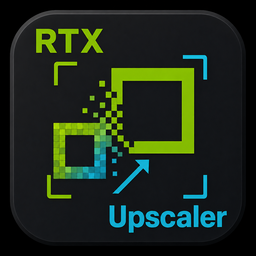
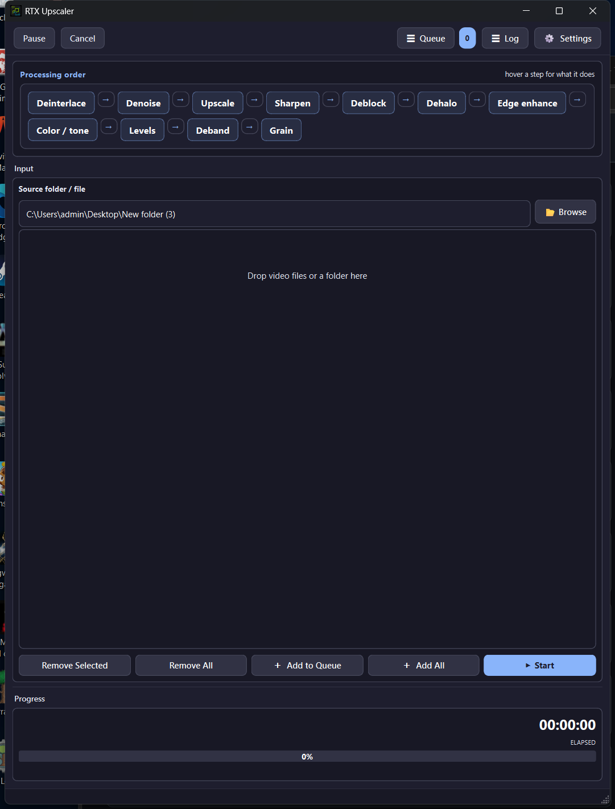
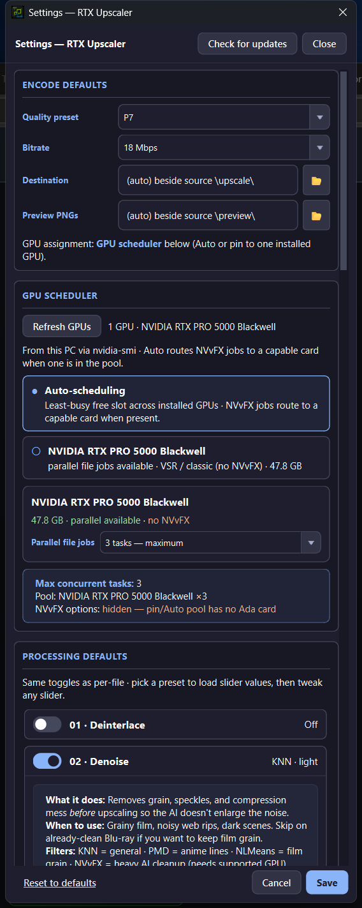

# RTX Upscaler

  

  
  
  
  

---

## What is RTX Upscaler? (plain English)

**RTX Upscaler makes videos look bigger and cleaner on an NVIDIA GPU.**

Example: a soft **720p** or **1080p** file → **4K**, with optional cleanup (noise, blocks, soft edges) so the enlarge step does not blow up compression junk.

You do **not** need command lines or encoding geekery. The app is a Windows window:

1. Drop your video(s) in  
2. Leave the defaults (or flip a few steps on/off)  
3. Click **Start** — finished files land in an `\upscale\` folder next to your source  

The heavy lifting is **NVIDIA Video Super Resolution (VSR)** via NVEncC (works on modern RTX cards). Optional **NVvFX** AI filters (heavy denoise / SuperRes) need an **Ada** GPU (compute 8.9, e.g. RTX 40-series). On Blackwell-only machines those NVvFX options stay hidden; **VSR still works**.

### What happens to each file

Think of it as a **cleanup chain**, then enlarge, then polish:

| Step | In plain words |
|------|----------------|
| **Deinterlace** | Fix old TV / 1080i “combing” into normal progressive frames (off if your file is already progressive). |
| **Denoise** | Remove grain and speckles *before* enlarge so noise does not get bigger. |
| **Upscale** | Grow the picture (VSR AI, or classic math like Lanczos). Default sweet spot: **VSR 3**. |
| **Sharpen / Deblock / Dehalo / Edge** | Put crispness back, soften blocks, kill halos, optionally pop anime lines. |
| **Color / Levels / Deband / Grain** | Light tone fixes, banding cleanup, optional film grain so AI results do not look plastic. |

Then it **encodes on the GPU** and keeps your original audio / subs when remuxing. Defaults aim at “drop in and go”: **VSR**, quality **P7**, output beside the source under `\upscale\`.

Hover any step in the app for a short “what it does / when to use” tip.

---

## Screenshots

  

<em>Main window — processing order, drop zone, Start.</em>

  

<em>Settings — encode defaults, GPU scheduler, per-step processing (with plain-English help).</em>

---

## How to use (quick start)

1. Install from [Releases](https://github.com/aberthil/RTXUpscaler-releases/releases/latest) and open **RTX Upscaler**.  
2. **Browse** or **drag-and-drop** video files (or a folder).  
3. Optional: click a pipeline step (or open **Settings**) to turn filters on/off or change VSR strength / resolution.  
4. **+ Add to Queue** (or **Add All**), then **Start**.  
5. When it finishes, open the `\upscale\` folder next to your source (or your custom destination).

**Queue / Log / Settings** are top-right. Pause and Cancel work while a job runs. Multi-GPU machines can auto-schedule parallel jobs; NVvFX jobs route to an Ada card when one is present.

---

## Download

| | |
|--|--|
| **Latest Setup** | [RTXUpscaler-1.0.8-Setup.exe](https://github.com/aberthil/RTXUpscaler-releases/releases/latest/download/RTXUpscaler-1.0.8-Setup.exe) |
| **All versions** | [Releases](https://github.com/aberthil/RTXUpscaler-releases/releases) |
| **SHA-256** | [RTXUpscaler-1.0.8-Setup.exe.sha256](https://github.com/aberthil/RTXUpscaler-releases/releases/latest/download/RTXUpscaler-1.0.8-Setup.exe.sha256) |

> Prefer the **latest** tag always:  
> https://github.com/aberthil/RTXUpscaler-releases/releases/latest

Installs to `C:\DolbyVisionScripts\RTXUpscaler` by default. Settings / Pushover / queue live in AppData and **survive App Update**. Only a full **Remove** wipes them.

Setup is large (~1.5 GB) because it ships the owned **VSR** (`nvcc_libs`) and **NVvFX** (`nvfx`) tool trees — no scavenger hunt for DLLs after install.

---

## Requirements

| | |
|--|--|
| OS | Windows 10/11 **x64** |
| GPU | **NVIDIA** RTX recommended |
| VSR (main upscale) | Modern RTX with NGX VSR support |
| NVvFX extras | **Ada** (compute 8.9) — denoise / artifact / SuperRes; hidden if no Ada in the pool |
| Disk | Large Setup + room for working files beside your sources |

---

## Install

1. Download **RTXUpscaler-*-Setup.exe** from [Releases](https://github.com/aberthil/RTXUpscaler-releases/releases/latest)  
2. Run Setup (admin)  
3. Launch **RTX Upscaler** from the Finish page / Start Menu  

**Update the app:** Settings → Check for updates / App update  
(keeps AppData userdata; Tool updates ≠ App update)

---

## Upscale engines (when you care)

| Path | Notes |
|------|--------|
| **VSR 1–4** | NVIDIA Video Super Resolution — default everyday AI enlarge. **VSR 3** = balanced; **VSR 4** = rough sources |
| **Classic** (spline / Lanczos / …) | Neutral resize, no neural look |
| **NVvFX SuperRes** | Ada-only neural upscale; **2× / 3× / 4×** only (no “same size”) |
| **NVvFX Denoise / Artifact** | Ada-only heavy AI cleanup before or instead of light filters |

---

## What's New

### v1.0.8

See the [Releases](https://github.com/aberthil/RTXUpscaler-releases/releases) page for notes on each Setup build.

---

## Links

- **Latest download:** https://github.com/aberthil/RTXUpscaler-releases/releases/latest  
- **This repo:** public Setup hosting + project page (source stays private)

---

## License / support

Windows installers for end users. Problems with a specific Setup: note the release tag and contact the publisher (`aberthil`).
